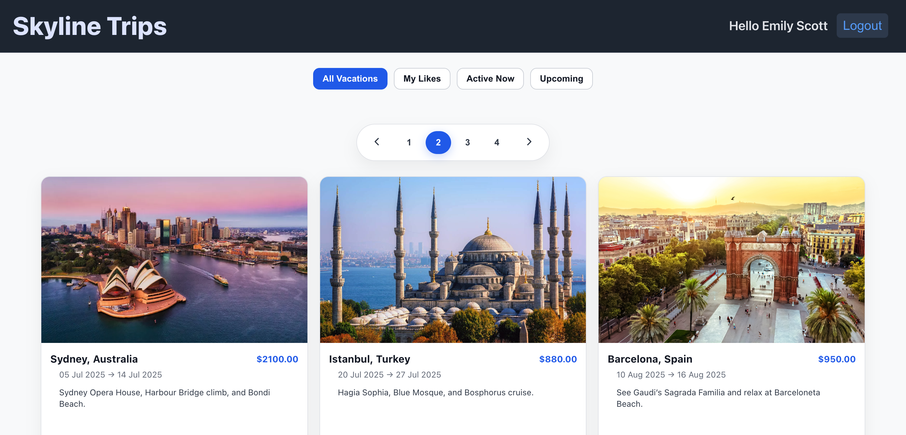
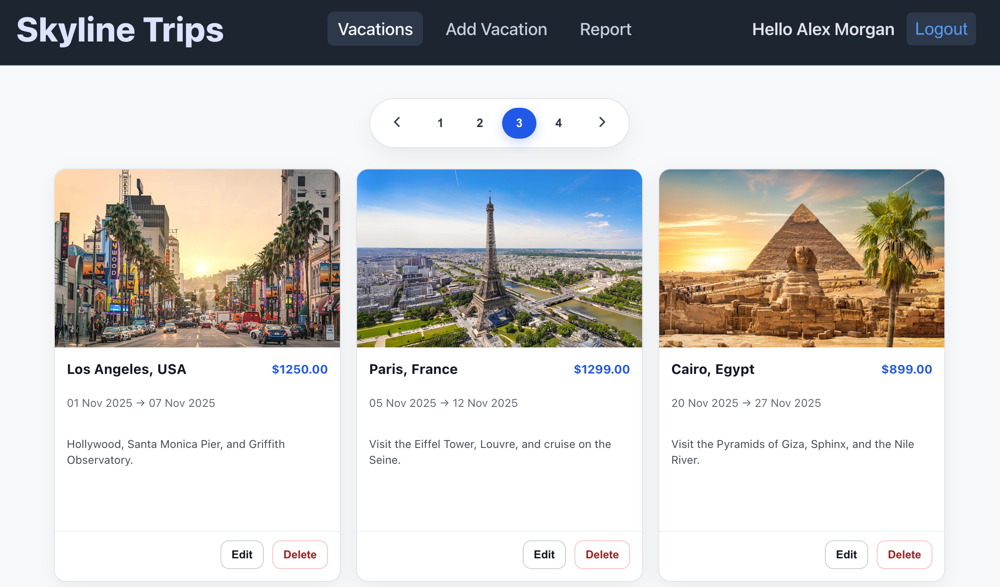

# Skyline Trips 

Skyline Trips is a full-stack vacation management platform that allows users to browse, like, and manage vacations, with a dedicated admin area for creating, editing, and reporting vacations.

---

## Live Demo

- **Frontend:** https://skyline-trips.vercel.app  
- **Backend API:** https://skyline-trips.onrender.com

---

## 🎥 Video Walkthrough

Short screen recordings demonstrating real user and admin flows.

- **User Flow:** [Watch on YouTube](https://youtu.be/M_8mVb14evM)
- **Admin Flow:** [Watch on YouTube](https://youtu.be/Zfi9lAFcvio)

---

## 🖼️ Screenshots

### User – Vacations Browse


### Admin – Vacation Management


### Admin – Reports


---

## 🔑 Demo Credentials

Use the following credentials to explore the application without registering:

### Admin
- **Email:** admin@demo.com  
- **Password:** Demo123!

### User
- **Email:** user@demo.com  
- **Password:** Demo123!

---

## Tech Stack

### Frontend
- React + Vite
- TypeScript
- Redux Toolkit
- React Router
- Axios
- CSS (modular component-based styling)

### Backend
- Node.js
- Express
- TypeScript
- MongoDB Atlas
- Mongoose
- JWT authentication
- Role-based authorization (Admin / User)
- Cloudinary (image uploads)

### Deployment
- Frontend deployed on **Vercel**
- Backend deployed on **Render**
- MongoDB hosted on **MongoDB Atlas**

---

## Features

### User
- Register & login with JWT authentication
- Browse vacations
- Like / unlike vacations
- Pagination & filtering
- Persistent authentication state

### Admin
- Create, update, and delete vacations
- Upload vacation images (Cloudinary)
- View vacation reports (JSON / CSV)
- Role-protected admin routes

---

## Architecture Highlights

- Monorepo structure (`frontend` / `backend`)
- Centralized configuration using environment variables
- Layered backend architecture:
  - Controllers
  - Services
  - Models
  - Middleware
- Protected API routes with JWT middleware
- Axios interceptor for automatic token handling
- SPA routing with proper Vercel rewrite configuration

---

## Environment Variables

### Backend
```env
MONGODB_CONNECTION_STRING=
JWT_SECRET_KEY=
HASH_SALT_KEY=
CLOUDINARY_CLOUD_NAME=
CLOUDINARY_API_KEY=
CLOUDINARY_API_SECRET=
ENVIRONMENT=production
```

### Frontend
```env
VITE_API_URL=https://skyline-trips.onrender.com
```
---

## Installation (Local Development)

```bash
# Clone the repository
git clone https://github.com/tom-liron/skyline-trips.git
cd skyline-trips

# Backend
cd backend
npm install
npm run build
npm start

# Frontend
cd frontend
npm install
npm run dev
```
---

## Project Focus

This project was built to practice and demonstrate:
- Full-stack development with TypeScript
- Secure authentication and authorization
- Clean separation between frontend and backend
- Real-world deployment and production configuration
- Debugging and resolving deployment issues (SPA routing, env vars, CORS)

---

## Notes
- This is an API-first application; the backend does not serve HTML pages.
- Images are served directly from Cloudinary using stored URLs.
- The project is continuously deployable via GitHub → Vercel / Render.

---

## Author
Tom Liron  
Full-Stack Developer  
GitHub: https://github.com/tom-liron
